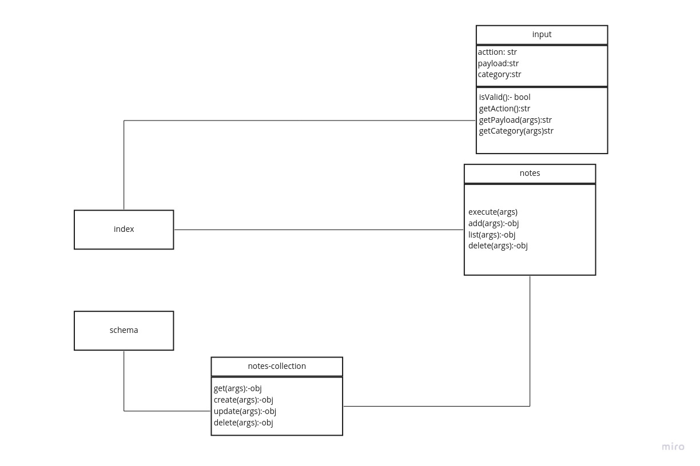

# Notesy

## Overview
A terminal based (CLI) application  
the user can create and manage a list of categorized notes

## Getting Started

These instructions will get you a copy of the project up and running on your local machine for development and testing purposes. See deployment for notes on how to deploy the project on a live system.

## Installation

**In your terminal**
`git clone https://github.com/ahmadkheder-401-advanced-javascript/notes/tree/class-4`

## Usage
1. add note:
 `node index.js --add or -a 'note content'`

## Architecture

This application was build with Node.js and it includes:
- minimist package
- dotenv package
- jest package 
- supergoose package

# UML diagram

